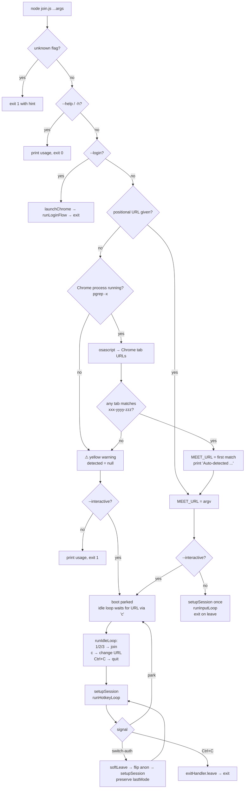

# Startup & Runtime Flows

Living doc for all the ways `join.js` can be invoked and how it behaves. Update
this whenever you add/change a flag, a hotkey, or a branch in `setupSession` or
the main IIFE.

Two views of the same thing:
- **Decision tree** (Mermaid) — visual, scans fast, good for the happy path.
- **State matrix** (table) — exhaustive, good for "did I handle case X?"

---

## 1. Startup decision tree

---

## 2. Flag / input matrix

Columns: what the user provided. Rows: what happens. `—` = flag absent.

### Top-level flags (mutually-exclusive-ish)

| `--login` | `--interactive` | URL arg | Chrome running | Meet tab open | → Result |
|---|---|---|---|---|---|
| ✓ | any | any | any | any | Opens accounts.google.com, persists cookies, exits. Honors `--anonymous` for profile dir. |
| — | — | ✓ | any | any | Non-interactive join with given URL. |
| — | — | — | ✓ | ✓ | Auto-detects URL, non-interactive join. |
| — | — | — | ✓ | ✗ | ⚠ "Chrome isn't running" warning NOT printed (Chrome IS running). Falls through → usage error, exit 1. **BUG-CANDIDATE:** no dedicated "Chrome running but no Meet tab" message. |
| — | — | — | ✗ | n/a | Prints bold-yellow ⚠ warning, then usage error, exit 1. |
| — | ✓ | ✓ | any | any | Boots parked with URL pre-filled. |
| — | ✓ | — | ✓ | ✓ | Auto-detects URL, boots parked with it pre-filled. |
| — | ✓ | — | ✓ | ✗ | Boots parked with no URL. User must press `c` before 1/2/3. **BUG-CANDIDATE:** 1/2/3 with no URL — what happens? |
| — | ✓ | — | ✗ | n/a | Prints ⚠ warning, boots parked with no URL. |

### Mode × Source × Auth matrix (for a single join)

| `--mode` | `--source` | `--anonymous` | `--headed` | Notable behavior |
|---|---|---|---|---|
| camera (default) | typed (default) | — | — | 1280x720 dark canvas, keystrokes from terminal, signed-in profile, headless. |
| camera | typed | ✓ | — | Anon profile → "Your name" prompt, bot joins as `BOT_NAME`. |
| camera | transcribed | — | — | Spawns transcribe.py, needs `.venv/bin/python` + RealtimeSTT. Colored sentences. |
| camera-overlay | * | — | — | Uses **real webcam** via persistent profile's camera permission. Lower-third text pill. |
| camera-overlay | * | ✓ | — | Anon profile may not have camera permission → black frame / prompt. **VERIFY:** does permission survive? |
| presentation | * | — | — | Non-interactive: auto-clicks "Share screen" after join. `getDisplayMedia` hooked, no picker. 1920x1080. |
| presentation | * | — | ✓ | Same, but with visible Chrome window (useful for debugging). |
| any | any | any | ✓ | Visible Chrome window; everything else identical. |
| any | any | any | — | Headless (default). Webcam still works (see `feedback_headless_webcam`). |

### Interactive hotkey state machine

| State | Key | Action | Next state |
|---|---|---|---|
| parked | 1 / 2 / 3 | `setupSession` then enter active | active(mode) |
| parked | c | prompt for URL | parked |
| parked | Ctrl+C | `process.exit(0)` | — |
| active | 1 / 2 / 3 | hot-swap mode via `installModeHook` | active(newMode) |
| active | a | soft-leave + rebuild with flipped anon, preserve mode + transcribing | active(sameMode, flipped anon) |
| active | l | soft-leave, return to parked | parked |
| active | t | toggle transcription (spawn/kill `transcribe.py`); mutually exclusive with typing | active(sameMode, transcribing flipped) |
| active | y | enter typing submode (live keystrokes → canvas); auto-disables transcribing | active(sameMode, typing=on) |
| active | Shift+Y | clear typedText | active |
| active | Esc | transcribing: clear transcript. typing: exit typing submode (text persists). | active |
| active | ? | print legend | active |
| active | Ctrl+C | `exitHandler.leave()` (full teardown) | — |
| typing | Esc | exit typing submode, typedText persists | active |
| typing | Enter / Backspace / printable chars | edit typedText, live-push to canvas | typing |
| typing | 1 / 2 / 3 / t / y / a / l | treated as literal characters (NOT hotkeys) | typing |
| typing | Ctrl+C | `exitHandler.leave()` | — |

---

## 3. Test plan / smoke matrix

This is the manual test ritual before shipping a startup/CLI change. Each row =
one command + one observable to verify. Walk the rows your change could have
affected. Full pass is 5-10 min; targeted changes are usually 1-2 rows.

### 3a. Startup — URL resolution

| # | Command | Preconditions | Expected observable | Verified |
|---|---|---|---|---|
| S1 | `node join.js --help` | — | Usage text printed, exits 0. | ☐ |
| S2 | `node join.js --bogus` | — | `Unknown option: --bogus`, exits 1. | ☐ |
| S3 | `node join.js meet.google.com/abc-defg-hij` | — | `Config: ...` banner, navigates, joins. | ☐ |
| S4 | `node join.js` | Chrome open with 1 Meet tab | `Auto-detected Meet URL from Chrome: ...`, joins. | ☐ |
| S5 | `node join.js` | Chrome open, NO Meet tab | Bold-yellow `⚠  Chrome is running but no Meet tab ...`, then usage error, exit 1. | ☐ 2026-04-14 fixed |
| S6 | `node join.js` | Chrome fully closed | Bold-yellow `⚠  Chrome isn't running ...`, then usage error, exit 1. | ☐ 2026-04-14 |
| S7 | `node join.js` | Chrome open, tab on `meet.google.com/new` | Usage error (regex rejects landing page). | ☐ |
| S8 | `node join.js` | Chrome open, 2+ Meet tabs | Picks first; no prompt yet. (TODO: prompt-with-timeout.) | ☐ |

### 3b. Startup — interactive

| # | Command | Preconditions | Expected observable | Verified |
|---|---|---|---|---|
| I1 | `node join.js --interactive <url>` | — | Boots parked with URL pre-filled, parked legend printed. | ☐ |
| I2 | `node join.js --interactive` | Chrome open, Meet tab | Auto-detects, boots parked. | ☐ |
| I3 | `node join.js --interactive` | Chrome closed | ⚠ warning, boots parked with no URL. | ☐ |
| I4 | `node join.js --interactive` + press `1` | Chrome closed (no URL) | Prints `No URL set — press c to set one first.` stays parked. | ☐ (already handled at join.js:2592) |
| I5 | `node join.js --interactive` + press `c` | Any | Prompts for URL. | ☐ |

### 3c. Mode × source × auth

| # | Command | Expected observable | Verified |
|---|---|---|---|
| M1 | `node join.js <url>` | Default camera/typed/signed-in, headless. Joins, accepts keystrokes. | ☐ |
| M2 | `node join.js <url> --mode camera-overlay` | Real webcam + lower-third text pill visible. | ☐ |
| M3 | `node join.js <url> --mode presentation` | Joins as presenter, 1920x1080, no screen picker. | ☐ |
| M4 | `node join.js <url> --source transcribed` | transcribe.py spawns; speech shows live. | ☐ |
| M5 | `node join.js <url> --anonymous` | Joins as `BOT_NAME` via "Your name" prompt. | ☐ |
| M6 | `node join.js <url> --headed` | Visible Chrome window. | ☐ |
| M7 | `node join.js --login` | Opens accounts.google.com, persists cookies. | ☐ |
| M8 | `node join.js <url> --anonymous --mode camera-overlay` | VERIFY: does webcam permission survive on anon profile? | ☐ |

### 3d. Interactive hotkeys (in-meeting)

| # | From state | Key | Expected | Verified |
|---|---|---|---|---|
| H1 | active | `1`/`2`/`3` | Hot-swap to that mode; no rejoin. | ☐ |
| H2 | active | `a` | Soft-leave, flip anon, rebuild session, same mode preserved. | ☐ |
| H3 | active | `l` | Soft-leave, return to parked. | ☐ |
| H4 | active | `?` | Print legend. | ☐ |
| H5 | parked | `1`/`2`/`3` | Build session, enter active in that mode. | ☐ |
| H6 | parked | `c` | Prompt for URL. | ☐ |
| H7 | parked | Ctrl+C | Exit cleanly. | ☐ |
| H8 | active | Ctrl+C | Full teardown via exitHandler. | ☐ |
| H9 | active | `t` | Toggle transcription on/off; python spawned/killed; canvas driven by transcript when on, mode label when off. | ☐ 2026-04-16 (on path) |
| H10 | active+transcribing | `a` | Auth toggle; transcription resumes after rebuild under new page. | ☐ |
| H11 | active | `y` | Enter typing submode; live keystrokes land on canvas. Auto-disables transcribing. | ☐ |
| H12 | typing | Esc | Exit typing submode; typedText persists on canvas. | ☐ |
| H13 | typing | `1`/`2`/`3`/`t`/`a`/`l` | Appended as text (NOT hotkeys). | ☐ |
| H14 | active | `Shift+Y` | Clear typedText; canvas reverts to mode label (or transcript if transcribing). | ☐ |

### 3e. Outstanding bugs / unverified cases (from backlog)

- [x] **S5** — distinct "Chrome running but no Meet tab" bold-yellow warning added 2026-04-14.
- [ ] **S7** — verify landing-page regex rejection works today. (Note: regex requires `xxx-yyyy-zzz`, so `/new` and `/` should be rejected by construction. Confirm empirically.)
- [ ] **S8** — implement multi-tab prompt-with-timeout.
- [x] **I4** — already handled: runIdleLoop refuses 1/2/3 with "No URL set" (join.js:2592).
- [ ] **M8** — does webcam permission carry to anonymous profile?
- [ ] Incognito Chrome windows — does AppleScript see them?
- [ ] Non-Chrome browsers (Safari/Arc/Brave/Edge) — generalize detection.
- [ ] **runInputLoop crashes on non-TTY stdin** — `join.js:2221` calls `process.stdin.setRawMode(true)` without a `process.stdin.isTTY` guard. If stdin is piped/redirected (e.g., running under CI, background job, non-interactive shell), throws `TypeError: setRawMode is not a function`. Other call sites in the file guard correctly (e.g., `join.js:2590`, `2612`). Fix: add `if (process.stdin.isTTY)` guard, and probably short-circuit the entire input loop to a no-op wait when there's no TTY. Found 2026-04-16 while testing Ctrl+C orphan behavior.
- [x] **`--interactive` ignored `--source`** — until 2026-04-16, `runHotkeyLoop` only handled mode-swap hotkeys (1/2/3/a/l/?) and the canvas showed mode labels (`"Camera Mode"` etc.). Typed keystrokes and the transcription feed were silently dropped, even though `printConfig` printed `source=${source}` as if it mattered. Root cause: interactive mode was designed purely to demo hot-swapping render pipelines; the source-of-text wiring lived only in `runInputLoop` (the non-interactive path). **Fixed 2026-04-16:** (1) `t` toggles transcription on/off at runtime — spawns/kills python tied to the current page. (2) `y` enters a modal typing submode: every keystroke lands on the canvas live; Esc exits; typedText persists so mode swaps preserve it; Shift+Y clears. Transcription and typing are mutually exclusive (enabling one disables the other). Transcription state is preserved across auth-toggle rebuilds; typedText is not (fresh-start assumption — change if needed).
- [x] **Ctrl+C orphan processes** — verified 2026-04-16: no leaks in camera/typed, camera/transcribed, or SIGINT-during-setup paths. Chrome, python, and node all reaped. Exit handler's 5s force-quit safety net never triggered.

See `~/.claude/projects/-Users-nickevans-google-meet-test/memory/project_next_steps.md`
for the full backlog.

---

## How to update this doc

When you add a flag, a hotkey, or a branch:
1. Add a row to the relevant matrix table.
2. If it's a new decision in startup, add a node to the Mermaid tree.
3. If it's a new edge case worth testing, add a checkbox under §3.

Render: GitHub renders Mermaid natively. In VS Code use the built-in preview
or the Mermaid extension. No build step.
